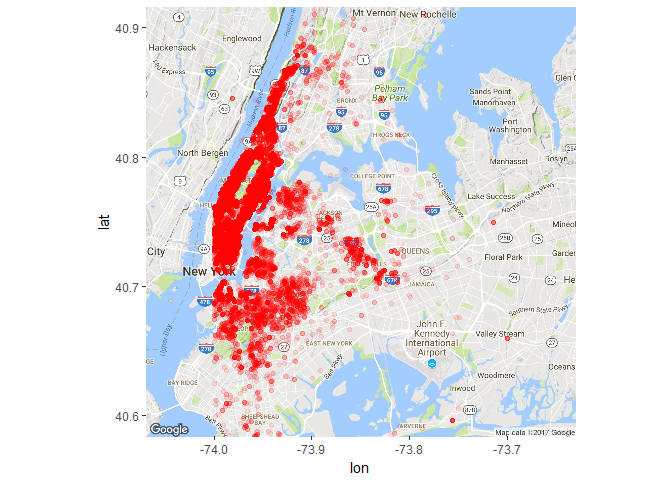

# Exploratory Data Analysis - Location

The following R Markdown doc contains: 

* Data cleaning/transformation 
* Data visualization
* Exploratory data analysis
* Descriptive statistics

The premise of this business problem seems pretty clear (like all Kaggle
competitions) - predict the popularity of apartment listings from an
app's user base.

Before diving into the data, I always find it useful to think of the
practical elements of the business problem. In my own experience of
searching for apartments online, the most important things are location
(location! location! location!) and price. I want to live close to where
I work/play and I only have a certain price range that I'm able to
afford. All other variables in the apartment searching process are
secondary - at least for me.

Let's see if the RentHop users act in a similar way:

    options(warn=-1)
    # Load packages and data
    packages <- c("jsonlite", "dplyr", "purrr", "ggplot2", "ggmap", "repr")
    purrr::walk(packages, library, character.only = TRUE, warn.conflicts = FALSE)

    data <- fromJSON("train.json")

    # unlist every variable except `photos` and `features` and convert to tibble
    vars <- setdiff(names(data), c("photos", "features"))
    data <- map_at(data, vars, unlist) %>% tibble::as_tibble(.)
    data <- as.data.frame(data)

It looks like they've included some interesting features to play with,
though I doubt some of these will have any predictive value - I can't
imagine the manager\_id or listing\_id are going to offer much useful
information.

Let's test our hypothesis and conduct some exploratory data analysis on
location, price, and the target variable.

    # Filter data by the features of interest
    geog <- select(data, latitude, longitude, price, interest_level)

    # Adjust size of ggplot visualizations
    options(repr.plot.width=5, repr.plot.height=4)
    # Basic scatter plot of latitude and longitude
    ggplot() + geom_point(data=geog, aes(x=longitude, y=latitude), color="blue", alpha = .05)

Creating a scatter plot of the latitude and longitude coordinates of the
entire sample, it appears that there are some significant outliers in
the data. Most of the apartment locations seem to be clustered near 40
latitude and -75 longitude.

Let's take a look at the interquartile ranges to verify that there's a
cluster of apartment listings at 40 lat and -75 long:

    # Quartile summary of latitude and longitude
    summary(geog[,c(1,2)])

    ##     latitude       longitude      
    ##  Min.   : 0.00   Min.   :-118.27  
    ##  1st Qu.:40.73   1st Qu.: -73.99  
    ##  Median :40.75   Median : -73.98  
    ##  Mean   :40.74   Mean   : -73.96  
    ##  3rd Qu.:40.77   3rd Qu.: -73.95  
    ##  Max.   :44.88   Max.   :   0.00

    # Get 1st and 99th percentile of latitude and longitude
    quantile(geog[,1], c(.01, .99))

    ##       1%      99% 
    ## 40.64040 40.86205

    quantile(geog[,2], c(.01, .99))

    ##        1%       99% 
    ## -74.01620 -73.85265

As we can see, 98% of the apartment locations lie between 40.64 to 40.86
latitude and -74.02 to -73.85 longitude. After removing the outliers we
get a much clearer picture of the apartment listings:

    geog <- filter(geog, latitude > 40, latitude <40.95, longitude > -74, longitude < -73.6)
    ggplot() + geom_point(data=geog, aes(x=longitude, y=latitude), color="blue", alpha=.2)

The apartment locations seem to be jutted up against a coastline, and it
certainly appears to be a big city. It would be logical guess that the
city is New York, since that is where the Kaggle competition sponsor is
located, but It's difficult to tell without context. Let's pull in the
ggmap package to overlay googlemaps on to the plot.

    gmap <- get_map(c(lon = -73.85, lat = 40.75), zoom = 11)

    ## Map from URL : http://maps.googleapis.com/maps/api/staticmap?center=40.75,-73.85&zoom=11&size=640x640&scale=2&maptype=terrain&language=en-EN&sensor=false

    map <- ggmap(gmap)
    map + geom_point(data=geog, aes(x=longitude, y=latitude), color="red", alpha = .1)

With the google maps backdrop we can confirm that the apartments are
located in New York. It appears that the majority of the listings are
located in Manhattan, with varying densities of apartments in Brooklyn,
Queens, and the Bronx.

    # Get the total number of apartments in the data set
    num_apartments <- dim(geog)[1]
    num_apartments

    ## [1] 42124

With the sheer amount of data on the plot it may be difficult to
identify patterns visually. One workaround to account for the large data
set is to break the apartment listings into subgroups.

    options(repr.plot.width=10, repr.plot.height=5)
    map + geom_point(data=geog, aes(x=longitude, y=latitude, color=interest_level), alpha = .1) + 
        facet_wrap(~ interest_level)

By breaking up the apartment listings by interest level, some clear
patterns begin to emerge. All three subgroups seem to have a high
density of apartments in Manhattan with a lower density of listings
outside of Manhattan. The 'low' interest level subgroup seems to have
higher variance in location as compared to the 'medium' and 'high'
subgroups.

To check our visual inspection of the data, we can compare the variance
in apartment locations for each subgroup:

    # Conduct feature scaling on latitude and longitude
    geog <- mutate(geog, scaled_lat = (latitude - min(latitude))/(max(latitude)-min(latitude)), 
                   scaled_long = (longitude - min(longitude))/(max(longitude)-min(longitude)))

    # Calculate the variance of the scaled latitude and longitude, grouped by interest level
    geog %>% 
        group_by(interest_level) %>%
        summarize(scaled_latitude_variance = var(scaled_lat), scaled_longitude_variance = var(scaled_long), num_listings = n())

    ## # A tibble: 3 x 4
    ##   interest_level scaled_latitude_variance scaled_longitude_variance
    ##            <chr>                    <dbl>                     <dbl>
    ## 1           high               0.02170361               0.016393736
    ## 2            low               0.01120707               0.006825458
    ## 3         medium               0.01395994               0.010245669
    ## # ... with 1 more variables: num_listings <int>

The variance in location (by scaled latitude and longitude) across each
interest level are not as I originally expected from looking at the
previous scatter plots. The 'low' interest level has the lowest variance
in both lat and long, while the 'high' interest level has the greatest
level of variance.

The differences in sample sizes across the subgroups suggests that the
previous scatter plots may be deceiving. The levels of variance indicate
that the 'high' interest apartment listings are more spread out across
the city, and the 'low' interest listings are more geographically
centered. The scatterplot with 'low' interest apartment listings does
not show a higher variance in geographic location, but simply displays
more data points.

After taking a closer look at the variance across each subgroup, this
pattern becomes more apparent:

    options(repr.plot.width=10, repr.plot.height=4)
    ggplot(geog, aes(latitude, color=interest_level, fill=interest_level)) + 
        geom_histogram(binwidth=1/200) +
        facet_wrap(~ interest_level)

    ggplot(geog, aes(longitude, color=interest_level, fill=interest_level)) + 
        geom_histogram(binwidth=1/200) +
        facet_wrap(~ interest_level)

The 'high' interest apartment listings seem to be more spread out than
'medium' and 'low' interest listings, but it's clear that there are much
fewer 'high' rated apartments vs 'low' rated apartments. These
distributions suggest that there is a higher proportion of 'high'
interest apartment listings in Brooklyn, Queens, and the Bronx as
compared to Manhattan.

After getting a snapshot of how the apartment popularity levels vary
across geographic location at a macro scale it's still hard to gauge if
there are any meaningful trends between these two variables. Virtually
every large area of the city has a healthy mix of both 'high' interest
and 'low' interest apartments.

A good next step would be to look at the location data at a more micro
scale. It may be the case that there is higher variability of interest
levels from neighborhood to neighborhood, or street to street, rather
than across large areas of the city.

Zooming into the previous scatter plot, we're able to take a look at
some of the listings near Central Park:

    options(repr.plot.width=12, repr.plot.height=5)
    gmap <- get_map(c(lon = -73.955, lat = 40.775), zoom = 15)

    ## Map from URL : http://maps.googleapis.com/maps/api/staticmap?center=40.775,-73.955&zoom=15&size=640x640&scale=2&maptype=terrain&language=en-EN&sensor=false

    map <- ggmap(gmap)
    map + geom_point(data=geog, aes(x=longitude, y=latitude, color=interest_level)) +
        facet_wrap(~ interest_level)

After zooming into the data, the trends identified in the previous
graphs become more clear. There don't appear to be any clusters of
'high' interest apartments or 'low' interest apartments. There seems to
be an equal spread of 'high', 'medium', and 'low' apartments across the
neighborhood. It's also apparent that there are significantly less
'high' interest listings than 'low' interest listings.

By looking at the variance in location across the different interest
levels for this small subset of listings, we can get a better feel for
the importance of location on a micro scale.

    # Filter data set by current map window
    micro_geog <- filter(geog, latitude >= 40.765, latitude <= 40.795, longitude >= -73.97, longitude <= -73.94)

    # Conduct feature scaling on latitude and longitude for micro_geog data set
    micro_geog[,c(5,6)] <- NULL
    micro_geog <- mutate(micro_geog, scaled_lat = (latitude - min(latitude))/(max(latitude)-min(latitude)), 
                   scaled_long = (longitude - min(longitude))/(max(longitude)-min(longitude)))

    # Summarize variance of location by interest level
    micro_geog %>% 
        group_by(interest_level) %>%
        summarize(scaled_latitude_variance = var(scaled_lat), scaled_longitude_variance = var(scaled_long), num_listings = n())

    ## # A tibble: 3 x 4
    ##   interest_level scaled_latitude_variance scaled_longitude_variance
    ##            <chr>                    <dbl>                     <dbl>
    ## 1           high               0.05338453                0.03087102
    ## 2            low               0.05468441                0.04069646
    ## 3         medium               0.05662276                0.04033225
    ## # ... with 1 more variables: num_listings <int>

After creating a subset of the apartment listings based on the map
window above, the variance of location across the different subgroups
remains very similar. This suggests that even at a micro level there is
not an obvious link between geographic location and the interest level
of the apartment listing.

    # Create variance histograms
    options(repr.plot.width=10, repr.plot.height=4)
    ggplot(micro_geog, aes(latitude, color=interest_level, fill=interest_level)) + 
        geom_histogram(binwidth=1/800) +
        facet_wrap(~ interest_level)

    ggplot(micro_geog, aes(longitude, color=interest_level, fill=interest_level)) + 
        geom_histogram(binwidth=1/800) +
        facet_wrap(~ interest_level)

The histograms of the variance of location confirm our initial thoughts.
Each of the subgroups have a very similar spread of geographic locations
of apartments (despite large differences in sample sizes).

From the exploratory data analysis into the location data at both the
macro and micro levels, it seems that location doesn't have an obvious
influence on the interest level of the apartment listing.

I think it's safe to say that the location data is still going to be
valuable in making predictions, but it doesn't appear that there are any
easy answers.

In the next exploratory data analysis script, I'll take a closer look
into the pricing data included in the training set.
