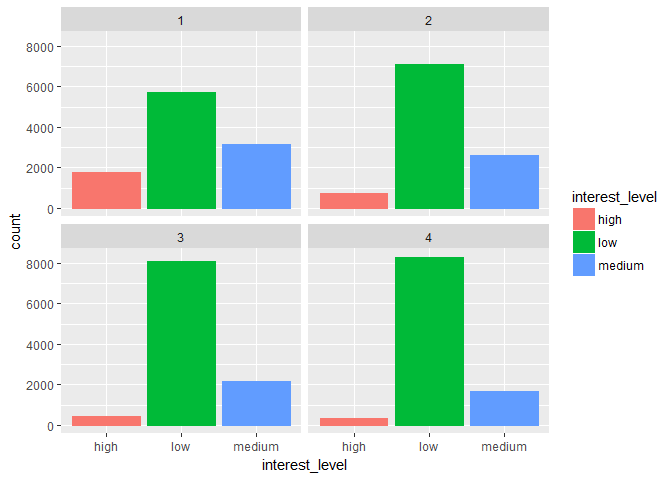
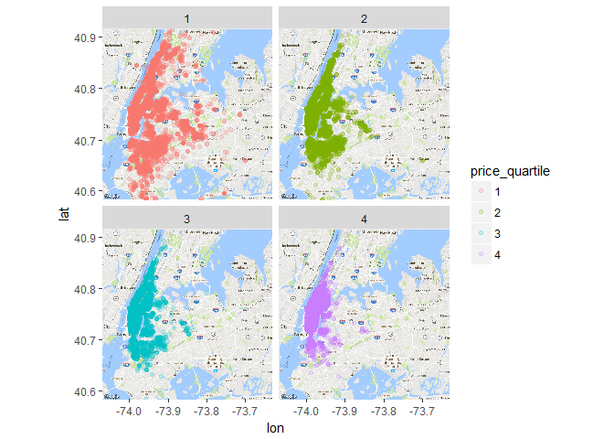
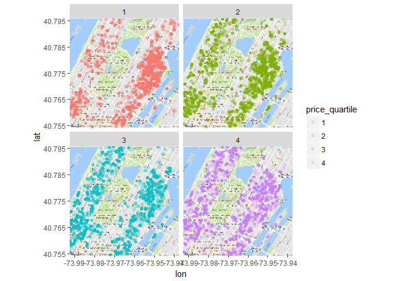
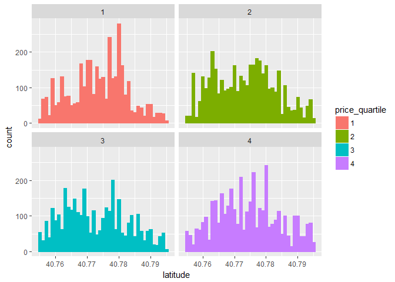
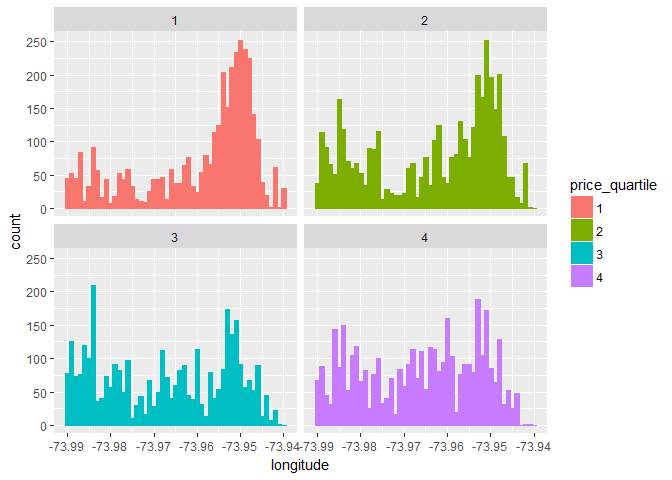
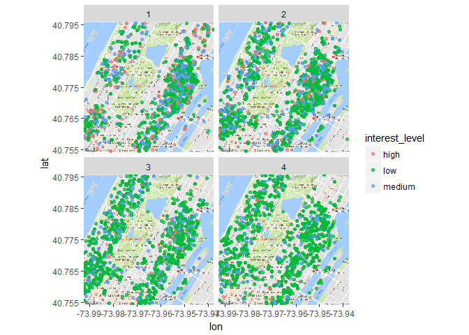

# Exploratory Data Analysis - Pricing

The following R Markdown doc contains: 

* Data cleaning/transformation
* Data visualization
* Exploratory data analysis
* Descriptive statistics

Following up on the previous exploratory data analysis script, this
notebook focuses on pricing data.

My initial hypothesis was that location and price would be the two most
important features in predicting the popularity of an apartment listing
for this Kaggle competition. In the last script I explored latitude and
longitude data, and found that there wasn't an obvious relationship
between geographic location and apartment popularity from which to build
an initial heuristic model (for non-data geeks like myself, a heuristic
model is a predictive model based on intuition/domain knowledge versus a
theoretically sound machine learning model).

In this notebook I'll take a look at the monthly rent price of each
apartment and look for trends between the rental price, geographic
location, and our target variable (interest level).

    # JSON data import
    options(warn=-1)
    # Load packages and data
    packages <- c("jsonlite", "dplyr", "purrr", "ggplot2", "ggmap", "repr")
    purrr::walk(packages, library, character.only = TRUE, warn.conflicts = FALSE)

    data <- fromJSON("train.json")

    # unlist every variable except `photos` and `features` and convert to tibble
    vars <- setdiff(names(data), c("photos", "features"))
    data <- map_at(data, vars, unlist) %>% tibble::as_tibble(.)
    data <- as.data.frame(data)

    # Select the variables of interest - price, location, target variable (interest level)
    geog <- select(data, latitude, longitude, price, interest_level)

    # Filter dataset by location to remove outliers (i.e. apartments not in New York)
    geog <- filter(geog, latitude > 40, latitude <40.95, longitude > -74, longitude < -73.6)

One of the quickest and most widely used methods for identifying
relationships between features is to look at the correlation. In this
case our variables of interest are price (continuous variable) and
interest level (ordinal variable - high, medium, low).

After converting the interest level variable to a numeric (high=1,
medium=0.5, low=0) we can calculate the Spearman's Rho correlation
coefficient.

    # Create a new column labeled 'interest_level_num' and convert the interest level variable to a numeric
    geog$interest_level_num <- ""
    geog[geog$interest_level=="low", "interest_level_num"] <- 0
    geog[geog$interest_level=="medium", "interest_level_num"] <- .5
    geog[geog$interest_level=="high", "interest_level_num"] <- 1
    geog$interest_level_num <- as.numeric(geog$interest_level_num)

    # Get the Spearman correlation for price and interest level
    corr <- cor.test(geog$price, geog$interest_level_num, method="spearman")
    corr

    ## 
    ##  Spearman's rank correlation rho
    ## 
    ## data:  geog$price and geog$interest_level_num
    ## S = 1.5534e+13, p-value < 2.2e-16
    ## alternative hypothesis: true rho is not equal to 0
    ## sample estimates:
    ##        rho 
    ## -0.2469749

The cor.test() function in R can be used to get the correlation
coefficient (labeled as 'sample estimates'). Although measuring the
correlation certainly has its limitations, it's an easy way to spot 1st
degree correlative relationships among variables. The obvious limitation
of Spearman's Rho correlation is that it does not measure 2nd or 3rd
degree relationships (think exponential or logarithmic relationships).

In this case we see a negative correlation of -.25, meaning that on
average as price increases the interest level decreases. This
correlation makes sense practically - people are interested in saving
money.

The cor.test() output also includes the p-value of the Spearman's Rho
correlation. In this case the p-value is extremely small (2.2e-16). The
standard alpha level for most research is .05, and since our p-value is
well below this level we can be confident in our results.

Understanding that there is a negative correlation between price and the
target variable, we can explore this relationship in more depth.

    # Get quartiles for apartment prices
    quantile(geog$price)

    ##      0%     25%     50%     75%    100% 
    ##      43    2400    3050    4000 1150000

    # Assign price quartile to each apartment listing
    geog$price_quartile <- ""
    geog[geog$price <= 2400, "price_quartile"] <- 1
    geog[(geog$price <= 3050 & geog$price > 2400), "price_quartile"] <- 2
    geog[(geog$price <= 4000 & geog$price > 3050), "price_quartile"] <- 3
    geog[geog$price > 4000, "price_quartile"] <- 4

By breaking up the apartment listings into price quartiles (1=lowest
price quartile, 4=highest price quartile), we can look at the trend
between rent price and interest level.

    options(repr.plot.width=7, repr.plot.height=5)
    ggplot(geog, aes(interest_level, color=interest_level, fill=interest_level)) + 
        geom_bar() + 
        facet_wrap(~ price_quartile)

As price increases there is a higher proportion of 'low' interest
apartments. This trend is consistent across each of the pricing
quartiles and aligns with our expectations from looking at the
Spearman's Rho correlation coefficient earlier.

From this point, it's clear that price will have predictive value in
determining the interest level of each apartment. Let's take a look at
pricing data across different locations in the city and see if we can
spot any visual trends.

    options(repr.plot.width=10, repr.plot.height=7)
    gmap <- get_map(c(lon = -73.85, lat = 40.75), zoom = 11)

    ## Map from URL : http://maps.googleapis.com/maps/api/staticmap?center=40.75,-73.85&zoom=11&size=640x640&scale=2&maptype=terrain&language=en-EN&sensor=false

    map <- ggmap(gmap)
    map + geom_point(data=geog, aes(x=longitude, y=latitude, color=price_quartile), alpha = .2) + 
        facet_wrap(~ price_quartile)

Right off the bat there appear to be some trends between location and
price. The lowest price quartile has listings that are more spread out
geographically than the top price quartile, which seem to be clustered
in Manhattan. This trend also makes sense practically - the apartments
in Brooklyn, Queens, and the Bronx are generally cheaper than the
apartments in Manhattan.

Since the apartment listings were broken into quartiles we can be sure
that each of the plots above contains the same number of data points, so
we can be confident in the trends in variance that we're seeing.

    options(repr.plot.width=10, repr.plot.height=7)
    gmap <- get_map(c(lon = -73.965, lat = 40.775), zoom = 14)

    ## Map from URL : http://maps.googleapis.com/maps/api/staticmap?center=40.775,-73.965&zoom=14&size=640x640&scale=2&maptype=terrain&language=en-EN&sensor=false

    map <- ggmap(gmap)
    map + geom_point(data=geog, aes(x=longitude, y=latitude, color=price_quartile), alpha = .2) + 
      facet_wrap(~ price_quartile)

Zooming into the data set, we can see even more trends between price and
location. In this case the lower priced apartments seem to be clustered
around several neighborhoods and the higher priced apartments are spread
out more evenly.

Looking at the histograms of location across price quartiles, this trend
becomes more apparent:

    # Filter data set by current map window
    micro_geog <- filter(geog, latitude >= 40.755, latitude <= 40.795, longitude >= -73.99, longitude <= -73.94)

    # Create variance histograms
    options(repr.plot.width=10, repr.plot.height=6)
    ggplot(micro_geog, aes(latitude, color=price_quartile, fill=price_quartile)) + 
        geom_histogram(binwidth=1/1000) +
        facet_wrap(~ price_quartile)

    # Create variance histograms
    options(repr.plot.width=10, repr.plot.height=6)
    ggplot(micro_geog, aes(longitude, color=price_quartile, fill=price_quartile)) + 
        geom_histogram(binwidth=1/1000) +
        facet_wrap(~ price_quartile)

On the macro scale the higher priced apartments are more clustered than
the lower priced apartments. However, after zooming in we can see that
the lower priced apartments appear to be more clustered on the micro
scale - from neighborhood to neighborhood.

    options(repr.plot.width=10, repr.plot.height=8)
    map + geom_point(data=geog, aes(x=longitude, y=latitude, color=interest_level), alpha = .7) + 
      facet_wrap(~ price_quartile)

Looking at price quartile, location, and interest level together doesn't
offer many clues. There doesn't seem to be much of a relationship
between location and interest level.

After exloring the pricing data it's clear that the listing price is
related to both location and the listing popularity. The negative
correlation between price and interest level seems obvious and
practical. The relationship between price and location is more
complicated and offers room for more exploration.

In my next notebook I'll combine the insights from the exploratory data
analysis into location, price, and interest level and start to engineer
features with predictive power.
