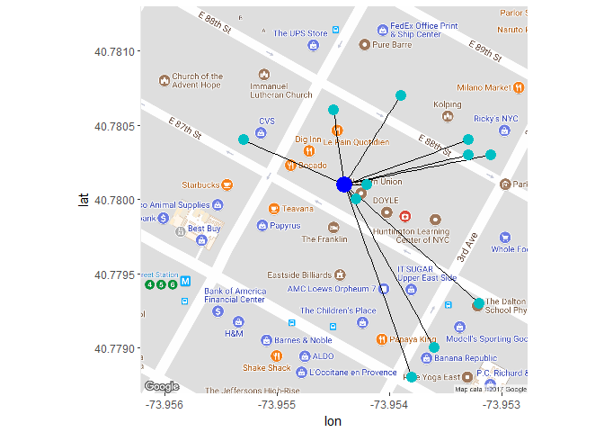

The following R Markdown document contains: \* Feature engineering \*
Algorithm development \* Data manipulation/cleaning with dplyr package
\* Data visualization with ggplot2 and ggmap packages \* Descriptive
statistics

In this notebook I've created an algorithm to engineer a new feature
that has predictive power for our target variable. The algorithm builds
upon the insights gained through exploratory data analysis into the
location and pricing data included in this Kaggle competition (here and
here).

The exploratory data analysis yeilded two major findings: 1) There is
not an obvious link between location and our target variable (popularity
of the apartment listing), that can be garnered from visually exploring
the data. 2) The monthly rent price had a noticeable and statistically
valid relationship with our target variable - lower price correlates
with higher popularity. In addition, there were several more nuanced
relationships between price, location, and the target variable that call
for more exploratory data analysis.

The following value score algorithm is based on a fundamental principle
of business - perceived value vs cost. Every time a consumer purchases a
good or service, the consumer's perceived value of that good or service
must be greater than its cost. Put another way, for virtually every
purchasing decision a consumer makes (from tennis shoes to getting a
haircut), that consumer considers the particular good or service more
valuable than its cost. This idea makes sense practically - if a t-shirt
costs 25 dollars, a consumer must make a decision on which item they
value more, the t-shirt or the 25 dollars.

The idea of perceived value vs cost can be applied to this Kaggle
problem. In this case the cost of each apartment listing is fixed, and
is provided to us in the data. Determining the perceieved value of each
apartment listing is going to be the tricky part. We know from practical
knowledge that the perceived value of real estate depends heavily on
location and size - a 2 bedroom apartment overlooking Central Park has a
much higher perceived value than a studio apartment in Queens.

By engineering the data, we can verify that our assumptions about real
estate are true. Let's start by importing the data:

    # JSON data import
    options(warn=-1)
    # Load packages and data
    packages <- c("jsonlite", "dplyr", "purrr", "ggplot2", "ggmap", "repr")
    purrr::walk(packages, library, character.only = TRUE, warn.conflicts = FALSE)

    data <- fromJSON("train.json")

    # unlist every variable except `photos` and `features` and convert to tibble
    vars <- setdiff(names(data), c("photos", "features"))
    data <- map_at(data, vars, unlist) %>% tibble::as_tibble(.)
    data <- as.data.frame(data)

To test this hypothesis, I created the following fairly straightforward
algorithm to calculate a value score for each aparment listing. For each
apartment listing the algorithm uses longitude and latitude coordinates
to generate a cluster of nearby apartments with similar characteristics
(same number of bedrooms and bathrooms). The algorithm then filters the
listings by the 50 closest apartments as determined by Euclidean
distance, and looks at the distribution of rental prices for this
subgroup. Based on the mean and standard deviation of this distribution,
the algorithm generates a value score (z-score) for the apartment.

    # Algorithm to calculate a value score for each apartment listings based on the prices of nearby apartments with similar characteristics
    apt_value <- function(data, apt_price, apt_lat, apt_long, apt_bedrooms, apt_bathrooms) {
      # Create subset of nearby apartments listings that have similar characteristics (same number of bedrooms and bathrooms)
      nearby_apts <- select(data, price, latitude, longitude, bedrooms, bathrooms) %>%
        filter(latitude >= apt_lat - .01,
               latitude <= apt_lat + .01,
               longitude >= apt_long - .01,
               longitude <= apt_long + .01,
               bedrooms == apt_bedrooms,
               bathrooms == apt_bathrooms)
      # Calculate the Euclidean distance of each of the nearby apartments, and sort the listings from nearest to farthest away
      nearby_apts <- nearby_apts %>% 
        mutate(distance = sqrt((latitude-apt_lat)^2 + (longitude-apt_long)^2)) %>% 
        arrange(distance)
      # Select the closest 50 apartments with similar characteristics (same number of bedrooms and bathrooms)
      if (dim(nearby_apts)[1] > 50) {
        nearby_apts <- slice(nearby_apts, 1:50)
      }
      # Calculate the 'value' of the apartment listings based on the mean and standard deviation of price of nearby apartments
      # Do not calculate value scores for apartments with less than 10 nearby apartments
      if (dim(nearby_apts)[1] >= 10) {
        mean_pr <- mean(nearby_apts$price, na.rm=T)
        sd_pr <- sd(nearby_apts$price)
        value_score <- (mean_pr - apt_price) / sd_pr
      } else {
        value_score <- NA
      }
      return(value_score)
    }

We can calculate a value score for each apartment listing in the data
set. The algorithm is fairly computationally expensive, and takes a
couple minutes to run through all ~47,000 listings.

    # Filter the data set by teh variables of interest
    value <- select(data, price, latitude, longitude, bedrooms, bathrooms, interest_level) 

    # Run the value score algorithm for every apartment listing
    # The apt_value function is computationally expensive and needs to be optimized
    value <- value %>%
      rowwise() %>%
      mutate(apt_value = apt_value(value, price, latitude, longitude, bedrooms, bathrooms))

    # Convert value scores to numeric data types
    value$apt_value <- as.numeric(value$apt_value)

In order to gauge the predictive ability of the algorithm we can run a
correlation between the interest level of the apartment and the value
score. If the hypothesis was right, we should get a positive correlation
between the value score and interest level.

    # Convert the interest_level variable to a numeric
    value$interest_level_num <- ""
    value[value$interest_level=="low", "interest_level_num"] <- 0
    value[value$interest_level=="medium", "interest_level_num"] <- .5
    value[value$interest_level=="high", "interest_level_num"] <- 1
    value$interest_level_num <- as.numeric(value$interest_level_num)

    # Calculate the Spearman's rho correlation between the value score and the interest level
    cor.test(value$apt_value, value$interest_level_num, method = "spearman")

    ## 
    ##  Spearman's rank correlation rho
    ## 
    ## data:  value$apt_value and value$interest_level_num
    ## S = 1.1947e+13, p-value < 2.2e-16
    ## alternative hypothesis: true rho is not equal to 0
    ## sample estimates:
    ##       rho 
    ## 0.3279469

As we can see we get a moderate, positive correlation between the value
score and the popularity of the apartment listing. This outcome supports
the initial hypothesis and suggests that both price and location are
important variables for predicting the popularity of each apartment.

There's also plenty of room for improvement to build upon this initial
algorithm. It would make sense to incorporate additional information
about each apartment into the perceived value score such as apartment
ammenities, the apartment's description, and photos.

A closer look at how the function works:
----------------------------------------

In the next part of the notebook, I'll go through the algorithm step by
step and provide visualizations along the way to display what is
happening.

In the following visualizations, I picked an apartment listing at random
on which to run the algorithm. The target apartment I picked out happens
to be located in Manhattan, just East of Central Park. The first step of
the value score algorithm creates a subgroup of apartment listings that
are within .01 latitude and .01 longitude from the target apartment. We
can see this subgroup in the map below.

    sbst <- filter(value, latitude >= 40.775, latitude <= 40.785, longitude >= -73.96, longitude <= -73.95)
    sbst <- as.data.frame(sbst)
    sbst <- mutate(sbst, id=c(1:(dim(sbst)[1])))
    target_apt <- filter(sbst, latitude==40.7801, longitude==-73.9544, price==2300, bedrooms==1, bathrooms==1)
    sbst <- filter(sbst, id != target_apt$id) 

    options(repr.plot.width=12, repr.plot.height=8)
    gmap <- get_map(c(lon = -73.955, lat = 40.78), zoom = 16)

    ## Map from URL : http://maps.googleapis.com/maps/api/staticmap?center=40.78,-73.955&zoom=16&size=640x640&scale=2&maptype=terrain&language=en-EN&sensor=false

    map <- ggmap(gmap)
    map + geom_point(data=sbst, aes(x=longitude, y=latitude), color="red", size=2.5) +
        geom_point(data=filter(target_apt), aes(x=longitude, y=latitude), color="blue", size=7)

In the next step of the algorithm, each apartment is determined to be
similar (same number of bedrooms and bathrooms) or not similar to the
target apartment. Then the algorithm removes the apartments from the
subgroup that are not similar to the target apartment.

    sbst$Type_of_Apartment <- "Not Similar Apartments"
    sbst[(sbst$bedrooms==1 & sbst$bathrooms==1), "Type_of_Apartment"] <- "Similar Apartments"

    options(repr.plot.width=12, repr.plot.height=8)
    gmap <- get_map(c(lon = -73.955, lat = 40.78), zoom = 16)

    ## Map from URL : http://maps.googleapis.com/maps/api/staticmap?center=40.78,-73.955&zoom=16&size=640x640&scale=2&maptype=terrain&language=en-EN&sensor=false

    map <- ggmap(gmap)
    map + geom_point(data=sbst, aes(x=longitude, y=latitude, color=Type_of_Apartment), size=2.5) +
      geom_point(data=filter(target_apt), aes(x=longitude, y=latitude), color="blue", size=7)

Next, the Euclidean distance is calculated between each of the remaining
apartment listings in the subgroup. The algorithm sorts the listings,
and filters out the closest 50 apartments that have the same number of
bedrooms and bathrooms as the target apartment.

    target_apt_lat <- 40.7801
    target_apt_long <- -73.9544
    sbst <- sbst %>% 
      mutate(distance = sqrt((latitude-target_apt_lat)^2 + (longitude-target_apt_long)^2)) %>% 
      arrange(distance)

    sbst <- filter(sbst, Type_of_Apartment=="Similar Apartments")
    sbst <- slice(sbst, 1:50)

    temp <- select(sbst, latitude, longitude)
    temp$target_apt_latitude <- 40.7801
    temp$target_apt_longitude <- -73.9544
    temp <- unique(temp)

    gmap <- get_map(c(lon = -73.9545, lat = 40.78), zoom = 18)

    ## Map from URL : http://maps.googleapis.com/maps/api/staticmap?center=40.78,-73.9545&zoom=18&size=640x640&scale=2&maptype=terrain&language=en-EN&sensor=false

    map <- ggmap(gmap)
    map + geom_segment(aes(x = longitude, y = latitude, xend = target_apt_longitude, yend = target_apt_latitude), 
                   color = "black", size = .7, data = temp) +
      geom_point(data=sbst, aes(x=longitude, y=latitude), color="#00BFC4", size=4) +
      geom_point(data=target_apt, aes(x=longitude, y=latitude), color="blue", size=6)

An interesting take away from the visualization is that there are
mulitiple apartment listings at each latitude and longitude point. The
overlapping listings suggest that there are multiple apartments listed
in the same building. We could confirm this by pulling in the
building\_id variable from the original data set.

Once the algorithm has created a subgroup of nearby apartments with
similar characteristics, it calculates the mean and standard deviation
of the distribution of rent prices across this subgroup. This
distribution is illustrated in the density graph below (as you can tell,
it is not a normal distribution). The z-score is calculated for the rent
price of the target apartment, based on this subgroup distribution. The
z-score represents the number of standard deviations the target rent
price is from the mean - which becomes the 'value score'.

    options(repr.plot.width=10, repr.plot.height=6)
    ggplot(sbst, aes(price)) +
      geom_density(adjust=1.3, color="grey", fill="grey") +
      geom_vline(xintercept = 2300, color="red", linetype = "longdash", size=1)

If we compare the target apartment's rent price to the distribution of
the entire sample, we can tell that the price distribution of nearby,
similar apartments is noticeably different than the price distribution
of the entire sample. The differences in the price distributions
betweeen the subgroup and total sample provides further evidence that
the original hypothesis is correct.

    # Remove outliers from price data
    price_lower_bd <- quantile(value$price, .005)
    price_upper_bd <- quantile(value$price, .995)

    value_temp <- filter(value, price >= price_lower_bd, 
                    price <= price_upper_bd,
                    bedrooms == 1,
                    bathrooms == 1)

    ggplot(value_temp, aes(price)) +
      geom_density(adjust=1.3, color="grey", fill="grey") +
      geom_vline(xintercept = 2300, color="red", linetype = "longdash", size=1)

